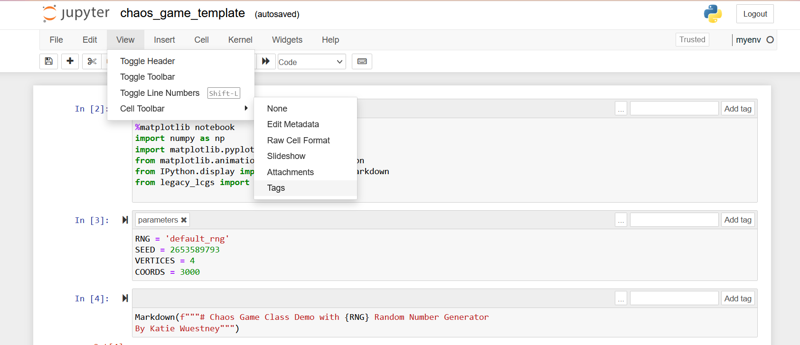
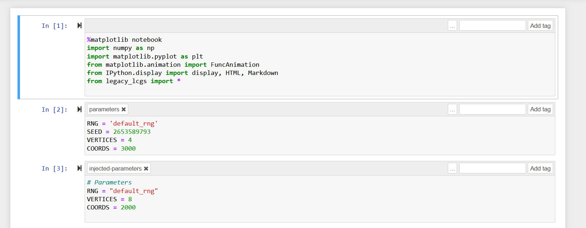
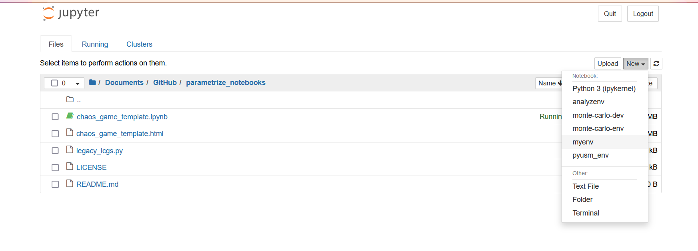
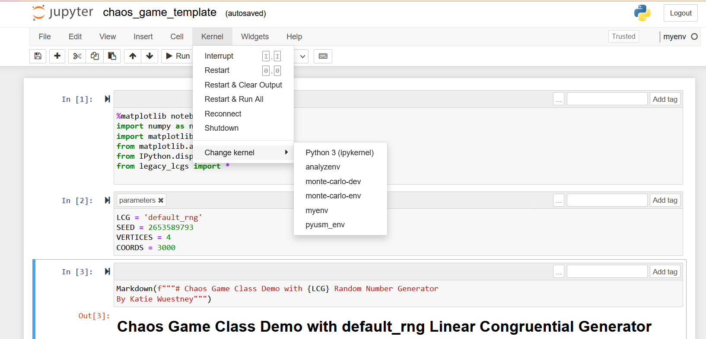

# parametrize_notebooks
 Tutorial discussing how to parametrize a jupyter notebook with papermill including tips and tricks for getting the most out of it. Subtopics include:
 - using cell tags
 - using a conda environment with a jupyter notebook
 - parameterize notebook
 - use a yaml file to feed parameters
 - outputing notebook file as html using nbconvert
 
 ## Requirements
 - python >= 3.7
 - papermill 
 - jupyter notebook
 - ipykernel
 
 ## Install papermill
 With conda
 ```console
 foo@bar:~$ conda install -c conda-forge papermill
 ```
 With pip
 ```console
 foo@bar:~$ python3 -m pip install papermill
 ```
 
 ## Using Cell Tags in a Jupyter Notebook
 
 Tags mark cells with metadata that can be used by other programs which process the notebook file. 
 
 Add tags to a cell using the drop down menu: 
 
 
 
 To parameterize a jupyter notebook we can put every parameter that we might want to control from the CLI in a cell with the tag 'parameters'. This tells papermill to insert a cell just below this cell with the parameters and the values set at the CLI.
 
 

 
 
 ## Setting the Notebook Environment to Run in a Conda Environment
 
 To get a jupyter notebook to run within a specific conda environment instead of the base environment you need to set the ipykernel.
 
 From within the conda environment, install the package ipykernel if not already installed.
 ```console
 foo@bar:~$ conda activate myenv
 (myenv) foo@bar:~$ conda install -c conda-forge ipykernel
 ```
 Then run the following command to make the conda active conda environment available as a kernel for jupyter notebook to run.

 ```console
 (myenv) foo@bar:~$ python -m ipykernel install --user --name=myenv
 ```
 Now this environment will be available within the jupyter notebook. To set this environment as the notebook kernel either launch jupyter   notebook from within the environment,
 ```console
 (myenv) foo@bar:~$ jupyter notebook
 ```
 or set it when creating a new notebook,
 
 
 
 or set it from within an active notebook.

 
 
 ## Use papermill from command line
 
 Run papermill from the CLI to execute a notebook with parameter values and output as a new file using this basic syntax.
 
 ```console
 (myenv) foo@bar:~$ papermill template.ipynb output.ipynb -p param1 1.0 -p param2 True
 ```
 
 For our example using the chaos_game_template.ipynb file, we will use the below command:
 
 ```console
 (myenv) foo@bar:~$ papermill chaos_game_template.ipynb chaos_game_defaultRNG.ipynb -p RNG default_rng
 ```
 
 If you can't remember what parameters are available to set in the notebook you can run the below command to get a description. Papermill will infer the parameters based on the parameters cell.
```console
(myenv) foo@bar:~$ papermill --help-notebook chaos_game_template.ipynb
Usage: papermill [OPTIONS] NOTEBOOK_PATH [OUTPUT_PATH]

Parameters inferred for notebook 'chaos_game_template.ipynb':
  RNG: Unknown type (default 'default_rng')
  SEED: Unknown type (default 2653589793)
  VERTICES: Unknown type (default 4)
  COORDS: Unknown type (default 3000)
```

Run the template again for other RNGs

 ```console
 (myenv) foo@bar:~$ papermill chaos_game_template.ipynb chaos_game_PASCAL.ipynb -p RNG PASCAL -p VERTICES 6
 ```
 ```console
 (myenv) foo@bar:~$ papermill chaos_game_template.ipynb chaos_game_RANDU.ipynb -p RNG RANDU -p VERTICES 6
 ```
 Papermill will parse numeric inputs. So to have them parsed as strings, use the -r flag for raw string instead of -p.
 
 
 To get progress bar for a particular cell excution add the following comment to the top of the code cell
 
 ```python
 #papermill_description=NAME_OF_PROCESS
 a = time_intensive_process()
 ```
 and the status bar will show with the name given.
 
 Example, in the chaos_game_template we add a description comment to the cell encoding the animation as js html
 ```python
 #papermill_description=ENCODING_ANIMATION
 mv = cg.movie()
 HTML(mv)
 ```
 and the console looks like this
 ```console
 (myenv) foo@bar:~$ papermill chaos_game_template.ipynb chaos_game_RANDU.ipynb -p RNG RANDU -p VERTICES 6
 Input Notebook:  chaos_game_template.ipynb
Output Notebook: chaos_game_PASCAL.ipynb

 Executing:   0%|                                                                                                                                   | 0/9 [00:00<?, ?cell/s]Executing notebook with kernel: myenv
Executing:  67%|██████████████████████████████████████████████████████████████████████████████████                                         | 6/9 [00:03<00:01,  2.10cell/s]No handler found for comm target 'matplotlib'
Executing ENCODING_ANIMATION: 100%|████████████████████████████████████████████████████████████████████████████████████████████████████████| 9/9 [01:03<00:00,  7.09s/cell]
```
 
 ## Use a YAML file 
 ```console
 (myenv) foo@bar:~$ papermill chaos_game_template.ipynb chaos_game_BCSLIB.ipynb -f parameters.yaml
 ```
 
 ## Convert Notebook to Other Format From CLI
 
 You can use nbconvert to convert the output notebooks into other formats for sharing or publishing, such as HTML. 
 
 Convert one notebook:
 ```console
 (myenv) foo@bar:~$ jupyter nbconvert --to html chaos_game_PASCAL.ipynb
 ```
 
 Or convert many:
 ```console
 (myenv) foo@bar:~$ jupyter nbconvert --to html chaos_game_*.ipynb
 ```
